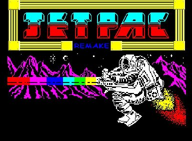

# **JetPac**

JetPac Remake written in C# using the XNA framework.

This is a fully playable attempt of converting the ZX spectrum original.

## **Please note** 
An updated version of this code that utilises Monogame can be found here: [Monogame](https://github.com/ian-wigley/MonoGame-Games) & a link to an online playable version can be found here [Github](https://github.com/ian-wigley/JetPac-Typescript).

